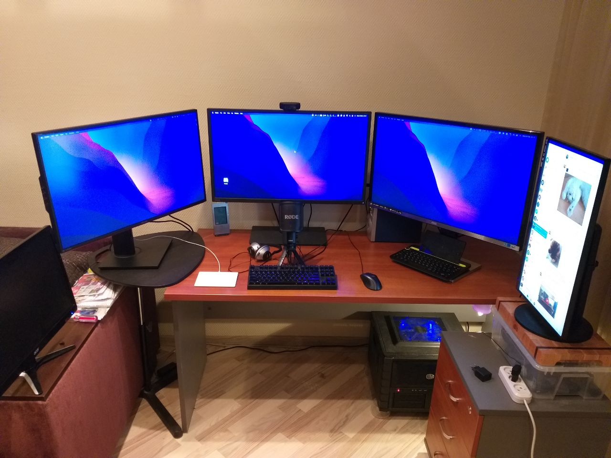
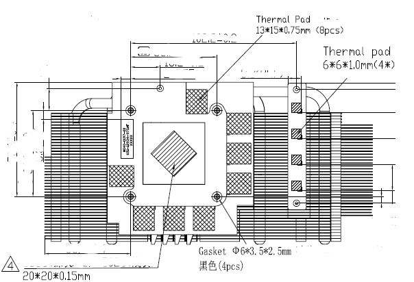
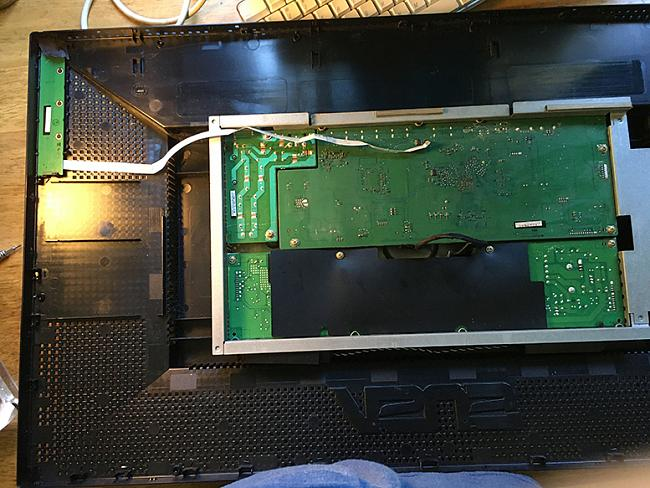
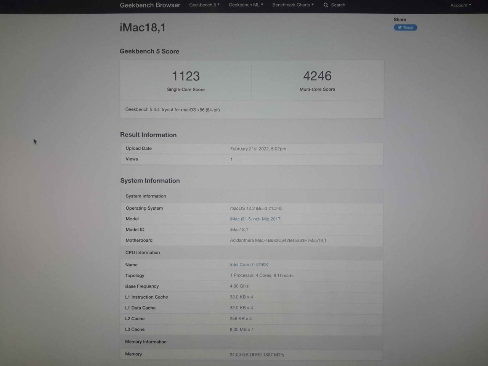
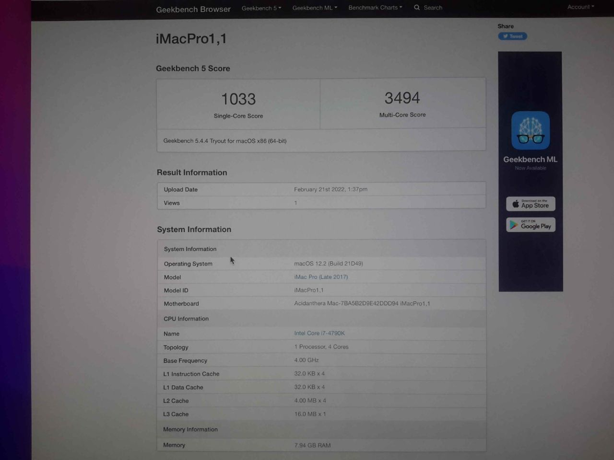

# Hackintosh - MacOS 12 Monterey

ЗОЧЕМ хакинтош? 3 \* 32" 4K


[Помощь в установке](https://baraholka.onliner.by/viewtopic.php?t=23550733)

## Config

MSI Z97 Gaming 5 + i7-4790K + 24GB DDR3-1600 (!) + Sapphire Pulse RX580 8GB

## Подключить раздел EFI

Запустить OpenCore Configurator и выбрать "Mount Partition" & "Open Partition"

## Изменения в BIOS

- Legacy UEFI + UEFI `->` UEFI
- Serial(COM) Port `->` Disabled
- Overclocking\CPU Features:
  - CFG Lock `->` Disabled

## Как переключить диск в OpenCore

Выбрать диск MacOS, затем [CTRL]+[ENTER].

## Что подправил Денис 13.03.2022

- Скопировал с флешки EFI
- Открыл EFI/OC/config.plist в OpenCore Configurator (лучше использовать ProperTree: DO NOT USE CONFIGURATORS, these rarely respect OpenCore's configuration and even some like Mackie's will add Clover properties and corrupt plists!)
- Игнор на предупреждение OpenCore Configurator (но если открывать через 2.56.0.0, а не через 2.58.1.0, то предупреждение не появляется): You seem to have an old version of OpenCore bootloader. This app creates a configuration file for 0.7.9 and higher versions. **Use at your own risk**
- Отключил ACPI/SSDT-UIAC.aml
- Добавил и включил в ACPI/Patch:
  - Rename EHC1 to EH01 (USB)
  - Rename EHC2 to EH02 (USB)
  - Rename XHCI to XHC (USB)
  - Rename XHC1 to XHC (USB)
- Исправил NVRAM/7C436110-AB2A-4BBB-A880-FE41995C9F82/boot-args: "keepsyms=1 -v" -> "keepsyms=1"
- Удалил UEFI/Drivers/OpenLinuxBoot.efi (OpenCore doc: **do not delete sections unless told explicitly so**)
- Отключил Misc/Show Picker
- Сохранил и закрыл OpenCore Configurator
- Удалил файл EFI/OC/Drivers/OpenLinuxBoot.efi

## VT-D

DisableIoMapper: YES
Needed to get around VT-D if either unable to disable in BIOS or needed for other operating systems, much better alternative to dart=0 as SIP can stay on in Catalina

## Fetch the OSK authentication key

macOS checks that it is running on real Mac hardware, and refuses to boot on third-party hardware. You can get around this by reading an authentication key out of your real Mac hardware (the OSK key). Save the first block of C code from this page as smc_read.c. In a command prompt, change into the same directory as that file and run:

```
xcode-select --install # If you don't already have gcc
gcc -o smc_read smc_read.c -framework IOKit
./smc_read
```

It’ll print out the 64 character OSK for you. Make a note of it.

Every Mac uses the same OSK, so don’t be surprised that it doesn’t look like a random string!

## Загрузка с NVMe

The macOS VM’s primary storage is the passthrough Samsung 970 Evo 1TB NVMe SSD, which can be installed onto and used in Monterey. However since Monterey TRIM is broken, and SetApfsTrimTimeout needs to be set in my config.plist to disable it so it doesn’t slow down boot. github.com/dortania/bugtracker/issues/192

## Относительно DEBUG и RELEASE версии

**DEBUG:** может значительно помочь в отладке проблем с загрузкой, однако может добавить заметную задержку во время загрузки (т.е. 3-5 секунд для перехода к подборщику). После установки вы можете легко перейти на RELEASE.

**RELEASE:** Гораздо более быстрая загрузка, однако в OpenCore практически отсутствует полезная информация DEBUG, что значительно усложняет поиск неисправностей.

## Ревизия config.plist "глазками" через ProperTree - какие значения требуются (имеются)

- Kernel/Quirks/DisableIoMapper `->` True (False)
- Kernel/Quirks/DisableRtcChecksum `->` False (True - и не буду трогать)
- Misc/Debug/AppleDebug `->` True (False)
- Misc/Debug/ApplePanic `->` True (False)
- Misc/Debug/Target `->` 67 (3)
- Misc/Debug/SecureBootModel `->` Default (Disabled - и не буду трогать)
- NVRAM/Add/7C436110-AB2A-4BBB-A880-FE41995C9F82/boot-args `->` -v keepsyms=1 debug=0x100
- Kernel/Quirks/AppleXcpmCfgLock `->` True (False) (Doc: this option should be avoided whenever possible.)

## Замечания OpenCore Configurator > Config Checker > Haswell > 0.7.9

- ACPI/Add/SSDT-UIAC.aml is disabled. Either enable it or remove it to get rid of this warning
- ACPI/Quirks/ResetLogoStatus = Yes but should normally be No
- Misc/Boot/PollAppleHotKeys = Yes but should normally be No
- Misc/Boot/ShowPicker = No but should normally be Yes
- Misc/Boot/PickerMode = External but should normally be Builtin
- Misc/Boot/HideAuxiliary = Yes but should normally be No
- Misc/Tools/ You can remove the tool EFIs here
- NVRAM/Add/boot-args = -v keepsyms=1 debug=0x100 You need to add alcid=<_layout_\> here since you are using AppleALC.kext
- PlatformInfo/Generic/SystemProductName = iMac18,1 this is not a suggested SMBIOS for Coffee Lake Desktop systems.
- UEFI/MinDate = -1 but should normally be 0 (Врёт!)
- UEFI/MinVersion = -1 but should normally be 0 (Врёт!)
- UEFI/AppleInput/GraphicsInputMirroring = Yes but should normally be No (Doc: The recommended setting on all hardware is true.)
- UEFI/Quirks/EnableVectorAcceleration = Yes but should normally be No

Полный список актуальных опций [тут](https://dortania.github.io/docs/latest/Configuration.html)

## Hardware

### CPU

В то же время с внедрением следующего технологического процесса с 14-нм нормами у Intel стали возникать разного рода трудности, поэтому через год, летом 2014 года, на рынок было выведено не следующее поколение процессоров Core, а вторая очередь Haswell, которая получила кодовые имена Haswell Refresh, или, если говорить о флагманских модификациях, то Devil’s Canyon. В рамках этого обновления Intel смогла заметно увеличить тактовые частоты 22-нм CPU, что действительно вдохнуло в них новую жизнь. В качестве примера можно привести новый старший процессор Core **i7-4790K**, который по номинальной частоте взял отметку в 4,0 ГГц и получил максимальную частоту с учётом турборежима на уровне 4,4 ГГц. Удивительно, что подобное полугигагерцевое ускорение было достигнуто без каких-либо реформ техпроцесса, а лишь за счёт простых косметических изменений в схеме питания процессоров и благодаря улучшению теплопроводящих свойств термопасты, используемой под крышкой CPU. [Источник](https://3dnews.ru/969891/ot-sandy-bridge-do-coffee-lake-sravnivaem-sem-pokoleniy-intel-core-i7)

### GPU

Толщина термопрокладок Sapphire Pulse RX580 8GB


**Q:** Какие брать? **A:** Laird Tflex HD90000

После майнинга? [old VBIOS](./hardware/back.rom.zip) `->` [new VBIOS](https://www.techpowerup.com/vgabios/197002/sapphire-rx580-8192-171115)

Маркировка памяти: SAMSUNG K4G80325FB-HC25

### Мониторы

[ASUS PA328](./hardware/ASUS_PA328.pdf) + [Обзор](https://www.ixbt.com/monitor/asus-pa328q.shtml)



[Time to upgrade your monitor](https://tonsky.me/blog/monitors/)

[Кастомные мониторы по Вашему заказу](https://www.avito.ru/moskva/tovary_dlya_kompyutera/kastomnye_monitory_po_vashemu_zakazu_1785645530)

## Почему нативный, а не Proxmox

Native


via [Proxmox](./PROXMOX-SETUP.md)


## UPD 15.06.2022

А я опять купил Z97 + 4790K + 24 GB. Будет второй Хакинтош - дублёр. Случайно выяснил, что Monterey работает на встройке, без внешней GPU. Мне нужен DisplayPort на материнке (чтобы тянуть 4K 60Hz) - это причина, почему Gaming 3, а не Gaming 5 (как в прошлый раз).

---

😺 We love cats!
